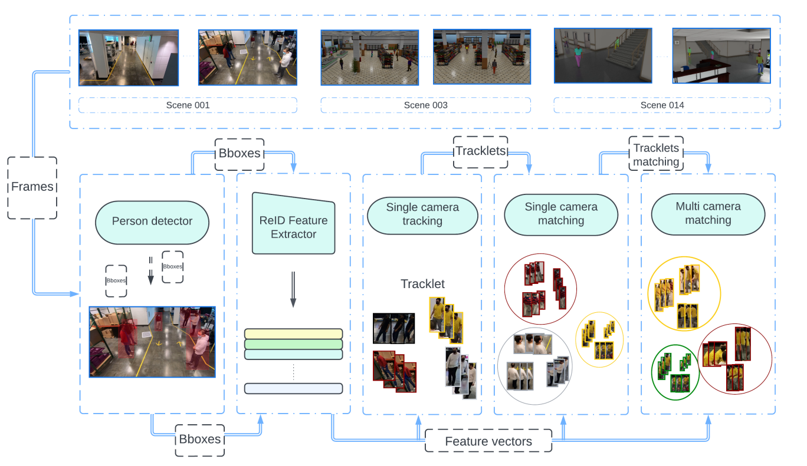
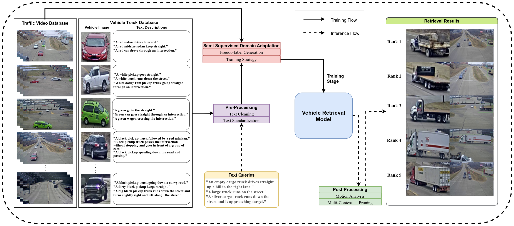

<!-- You can also find my articles on <a href="https://scholar.google.com/citations?user=xC3keU4AAAAJ&hl=en"> my Google Scholar profile </a>   -->

<strong>Publications</strong>  

<table >
<tbody>
<tr> <td style="width:170px; height=120px; vertical-align: top;">  </td>
<td style= "height=120px; vertical-align: top;"> 

<u> Quang Qui-Vinh Nguyen </u>, Huy Dinh-Anh Le, Truc Thi-Thanh Chau, Duc Trung Luu, Nhat Minh Chung, Synh Viet-Uyen Ha   <strong> Multi-camera People Tracking With Mixture of Realistic and Synthetic Knowledge</strong>  
<i> Accepted at CVPRW 2023 <a href="https://arxiv.org/pdf/2109.11048.pdf"> [PDF] </a>   </i>  
 </td>
</tr>
</tbody>
</table>

<table >
<tbody>
<tr> <td style="width:170px; height=120px; vertical-align: top;">  </td>
<td style= "height=120px; vertical-align: top;"> 

Huy Dinh-Anh Le <u> Quang Qui-Vinh Nguyen </u>,  Duc Trung Luu, Truc Thi-Thanh Chau, Nhat Minh Chung, Synh Viet-Uyen Ha   <strong>Tracked-Vehicle Retrieval by Natural Language Descriptions With Multi-Contextual Adaptive Knowledge</strong>  
<i> Accepted at CVPRW 2023  <a  href="https://openaccess.thecvf.com/content/CVPR2023W/AICity/papers/Le_Tracked-Vehicle_Retrieval_by_Natural_Language_Descriptions_With_Multi-Contextual_Adaptive_Knowledge_CVPRW_2023_paper.pdf"> [PDF] </a> <a href="https://github.com/ctyeong/CH-Rand"> </i>  
 </td>
</tr>
</tbody>
</table>

